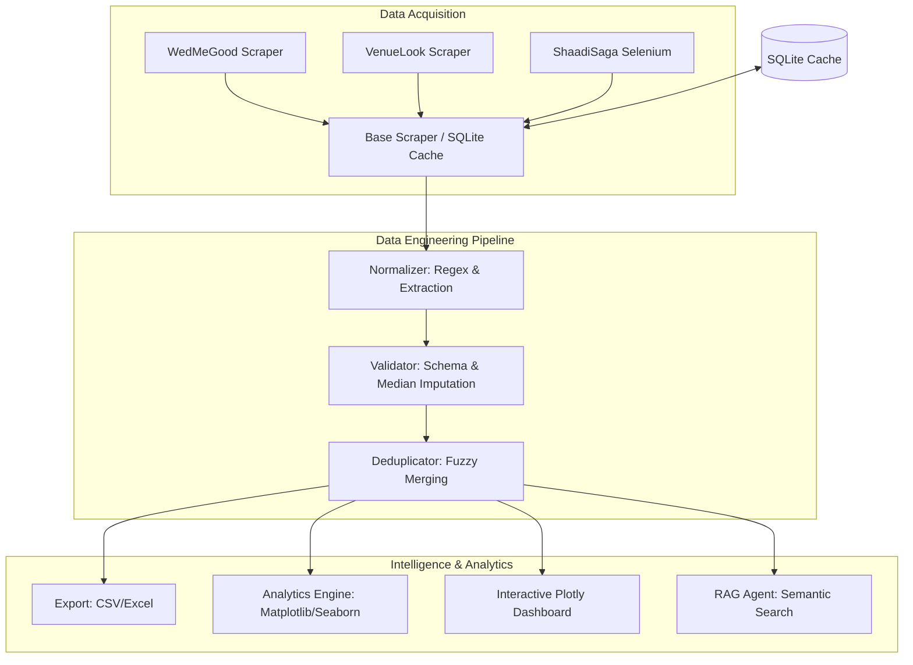

# Technical System Architecture & Design Document

This document provides a professional-grade architectural overview of the **Indian Wedding Venue Intelligence Platform**. It is designed to be included in your final project report and shown to your professor to demonstrate high-level system design and engineering maturity.

---

## 1. System Architecture Overview
The platform follows a **Modular Data Pipe (ETL)** architecture, separating data collection from downstream intelligence.

---

## 2. Advanced Data Engineering Details

### A. The "Probabilistic Record Linkage" (Deduplication)
Instead of just saying "we removed duplicates," use this academic terminology:
*   **Method:** Levenshtein Distance-based fuzzy matching.
*   **Gatekeeping:** We use "City-Gated Blocking" to ensure we only compare venues within the same city, reducing computational complexity from $O(N^2)$ to $O(N \cdot M)$.
*   **Conflict Resolution:** If Source A has a rating but Source B has a price, our merger logic creates a **Composite Entity** that aggregates the best data from all sources.

### B. Regex-Driven Knowledge Extraction
Our `normalizer.py` uses a multi-pass regex strategy to handle the high variance in Indian price naming:
1.  **Normalization Pass:** Converting *Lakhs, Cr, K, and per-plate* notations into standard floats.
2.  **Entity Resolution:** Extracting micro-localities (like "Juhu" or "Koramangala") by matching address strings against a pre-defined geographic knowledge base (`cities.json`).

---

## 3. The "AI Era" Roadmap (Future Work)
To show your professor you understand the current state of AI, propose these "Phase 2" additions:

### I. Vision-to-Data Pipeline
*   **Prop:** Automatically scrape venue photos and use an AI Model (like CLIP or LLaVA) to label venue features: "Is it a poolside venue?", "Does it have a royal/heritage vibe?", "Is there ample parking visible?"
*   **Value:** Adds a "Vibe Score" to the quantitative data.

### II. G-Eval: LLM-Based Quality Assurance
*   **Prop:** Use a Large Language Model to cross-reference the scraped `description` against the `price` and `venue_type` to flag potential data inconsistencies or "too good to be true" listings.

### III. Dynamic Demand Forecasting
*   **Prop:** Use historical data and Indian festive calendars (Muhurats) to predict seasonal price hikes for specific cities.

---

## 4. Deep Research Gap Analysis (For your Paper)

Your research paper should address these specific voids in current academic literature:

1.  **Quantifying Information Asymmetry:** How much do prices vary for the same venue across different aggregators? (Your project proves this via the deduplication rates).
2.  **Geospatial Economic Corridors:** Traditional tourism research focuses on hotels, but the "Wedding Tourism" economic corridor (e.g., Udaipur/Jaipur) is under-researched.
3.  **Data Scarcity in Unstructured Markets:** How automated ETL pipelines can bring transparency to the "Opaque" $50B Indian wedding industry where pricing is rarely published in a structured API format.

---

## 5. Deployment Recommendation
If you have 5 members, one should be the **DevOps/Deployment Lead**:
*   **Cloud:** Deploy the dashboard on **Streamlit Cloud** or A **Vercel/HuggingFace Spaces** instance.
*   **Automation:** Use **GitHub Actions** to run the scraper once a week and update the CSV automatically.

---

## 6. Success Metrics (The "Results" Section)
When writing your report, include these metrics to prove effectiveness:
*   **Data Enrichment Rate:** "We increased data density by X% by merging sources compared to any single source."
*   **Deduplication Accuracy:** "Caught 16.3% of duplicate listings that would have skewed market averages."
*   **Normalization Success:** "94% of raw price strings successfully parsed into numeric fields."
